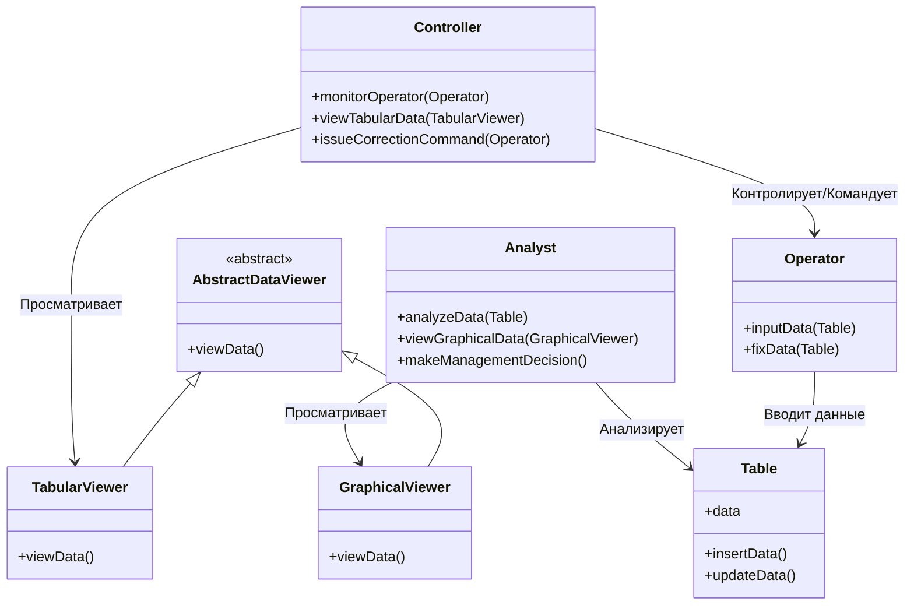
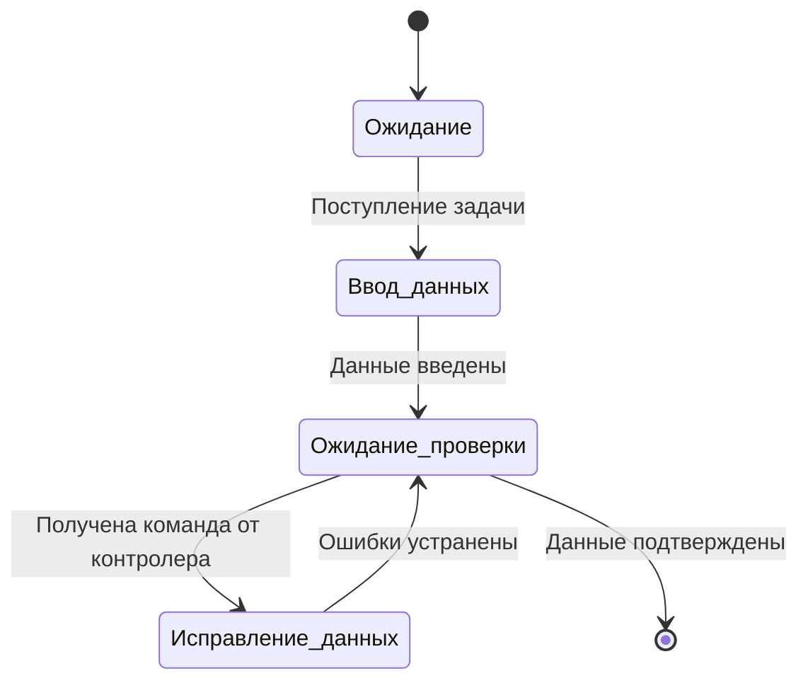
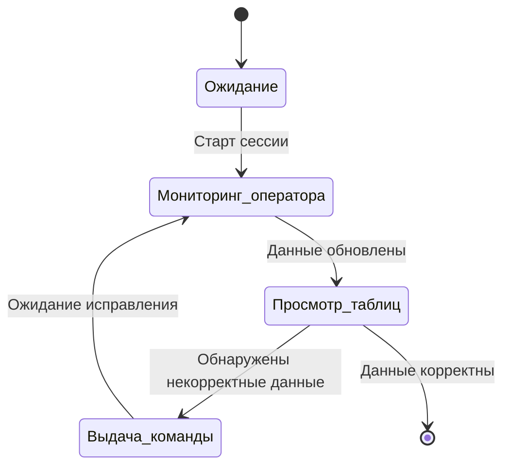
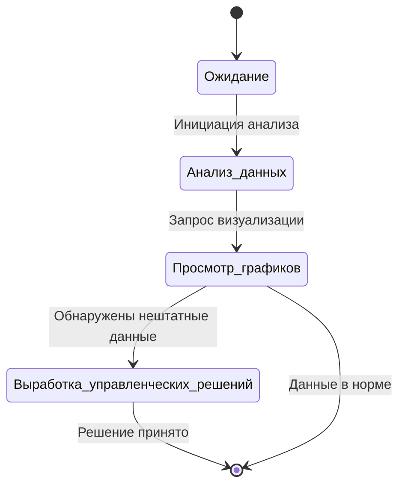
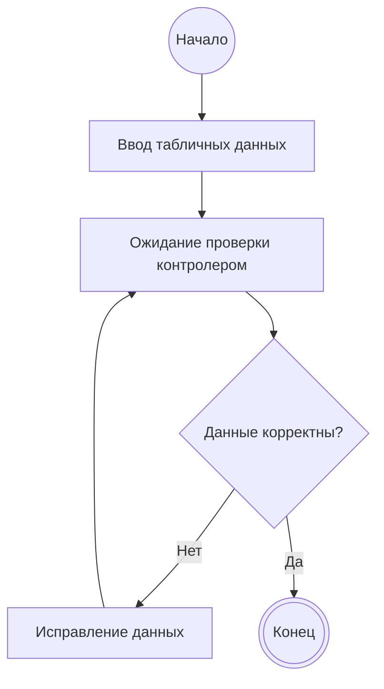
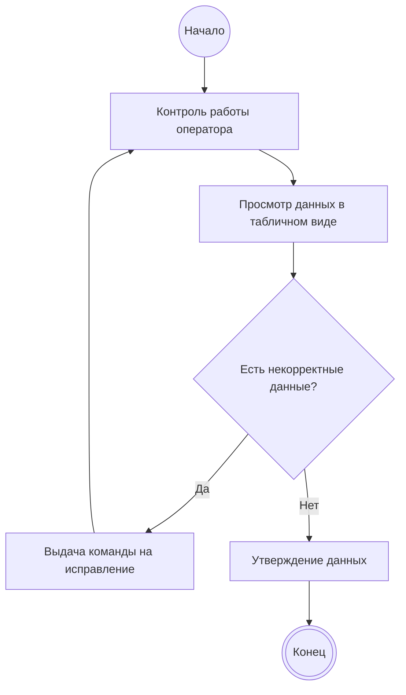
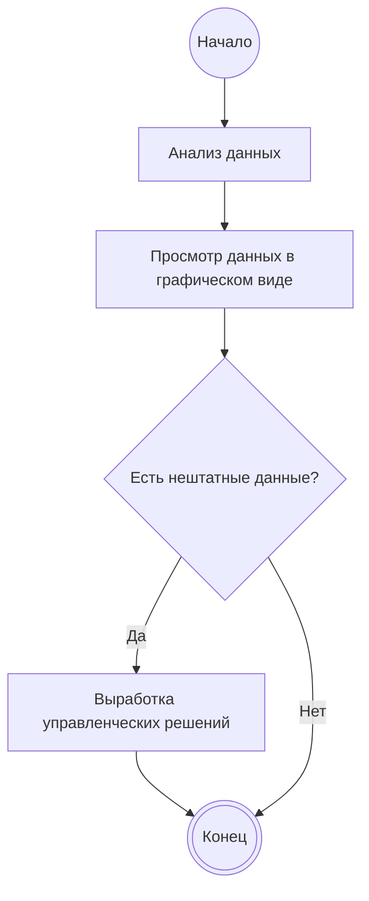
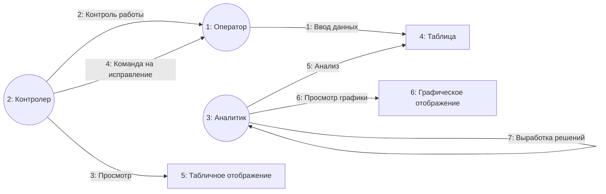
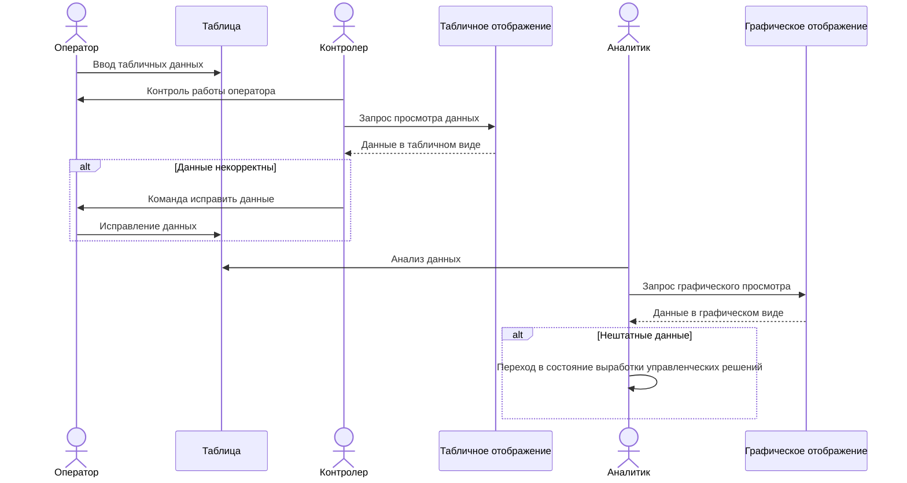

# Моделирование функционирования программной системы

## Вариант 1. Диаграмма классов
Отражает статические связи между основными сущностями системы с учетом наследования средств отображения.

---

## Вариант 2. Диаграмма состояний оператора
Отражает жизненный цикл работы оператора с данными.

---

## Вариант 3. Диаграмма состояний контролера
Отражает реакцию контролера на вводимые данные.

---

## Вариант 4. Диаграмма состояний аналитика
Отражает переход аналитика в специфическое состояние при обнаружении аномалий.

---

## Вариант 5. Диаграмма деятельности оператора
Отражает алгоритм действий оператора.

---

## Вариант 6. Диаграмма деятельности контролера
Отражает алгоритм проверки и возврата данных.

---

## Вариант 7. Диаграмма деятельности аналитика
Отражает алгоритм аналитики и принятия решений.

---

## Вариант 8. Диаграмма сотрудничества (Кооперации)
Отражает граф взаимодействия экземпляров объектов и порядок передачи сообщений.

---

## Вариант 9. Диаграмма последовательности
Отражает временную шкалу вызовов методов и процессов между сущностями.

