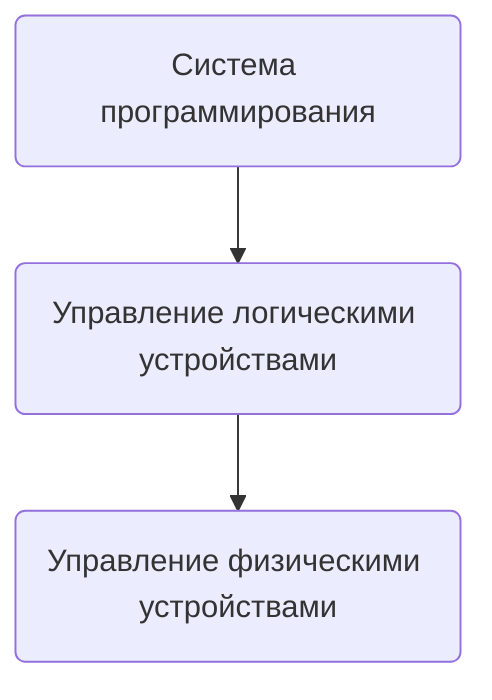

# Модуль 1 - Системное администрирование

#### Надо будет поднять какой-то сервис дома и администрировать его, типа:
##### Почты, адблоки, дальше не услышал но ВПН тоже подойдёт наверное

*Ещё будет администрирование Windows немного, написание драйверов много и в том числе как ДЗ*

---

# Полезные книги

[KMPG - Kernal Module Programming Guide](https://ruvds.com/wp-content/uploads/2022/10/The-Linux-Kernel-Module-Programming-Guide-ru.pdf)

[О драйверах](https://www.rulit.me/books/razrabotka-yadra-linux-read-376201-1.html?spm=a2ty_o01.29997173.0.0.4e5d55fb8Jafb6)

[Системное программное обеспечение - Эндрю Таненбаум](https://flibusta.su/book/15210-sovremennyie-operatsionnyie-sistemyi/?spm=a2ty_o01.29997173.0.0.4e5d55fb8Jafb6)

---

# Основные идеи развития технологий

1) За > 70 лет разработки вычислительной техники разработчики поняли что надо упрощать процесс разработки, для чего требуются высокотехнологичные средства.*Сейчас наверху средства разработки на основе ИИ.*

2) Создание не специализированных суперкомпьютеров, как ЭВМы в 70-х, а широко распространённой вычислительной техники

3) Большая часть вычислительных систем должна продаваться миллионными или даже миллиардными экземплярами. 

---

# Операционная система - очень расплывчатая категория

